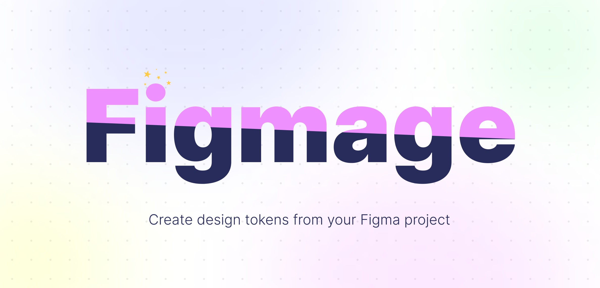
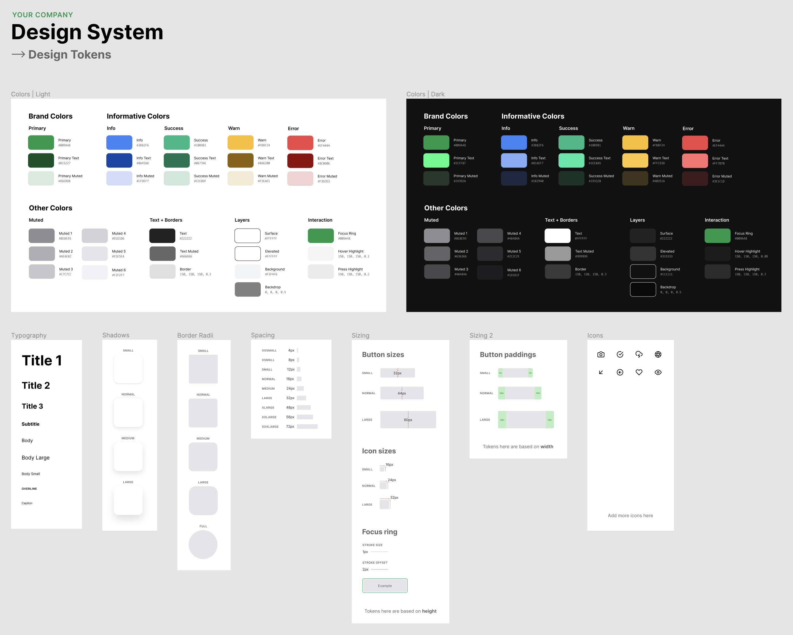

<p align='center'>
  
<p/>

# 🧙‍♂️ Figmage 🧙

A simple CLI tool that helps you generate design tokens as code from your Figma project.

## Installation

This tool can be used as a global package if you don't want to include it as a dependency in each of your projects:

```sh
npm install -g figmage
```

You can also utilize `npx` to run this tool without installing it:

```sh
npx figmage tokenize --config ./path/to/.figmage.json
```

Or you can install it locally in your project:

```sh
npm install figmage
```

### Environment variables

1. Get an [access token](https://www.figma.com/developers/api#access-tokens) for Figma API
2. Retrieve the file id of the Figma file
3. Create `.env` file (or any env file that is supported by [dotenv](https://github.com/motdotla/dotenv))
4. Paste the access token and the file id in the env file

```sh
FIGMA_ACCESS_TOKEN="xxxxx-xxxxxxxx-xxxx-xxxx-xxxx-xxxxxxxxxxx"
FIGMA_FILE_ID="xxxxxxxxxxxxxxxxxxxxxx"
```

## Configuration

Create a file called `.figmage.json` or `.figmagerc` in your project or add the config in your `package.json` under `"figmage"` key.

In addition to generic options the config has two concepts that map directly to the available commands: `tokenize` and `codegen`.

```json
{
  "outDir": "tokens",
  "tokenize": {},
  "codegen": {}
}
```

### Tokenize

Fetch meta data about your Figma project and turn them into a generic design token specification.

Command:

```sh
figmage tokenize
```

Under `tokenize` you have the `tokens` property which is a list of all the design tokens that should be handled by Figmage.

```json
{
  "tokenize": {
    "tokens": [
      { "name": "colors", "type": "color" },
      { "name": "gradients", "type": "linear-gradient" },
      { "name": "typography", "type": "text" },
      { "name": "shadows", "type": "drop-shadow" },
      { "name": "icons", "nodeId": "x:x", "type": "svg" },
      { "name": "spacing", "nodeId": "x:x", "type": "height" },
      { "name": "elevation", "nodeId": "x:x", "type": "width" },
      { "name": "sizing", "nodeId": "x:x", "type": "dimensions" },
      { "name": "radii", "nodeId": "x:x", "type": "radius" }
    ]
  }
}
```

In addition to the `tokens` field you can provide an optional `groupSeparator` that tells Figmage which character in the Figma layer name acts as a split point for grouping logic. This can be very useful for example when you want to have two sets of colors: one for light mode and one dark mode. For this scenario you could name your colors like this: `Primary | Light` + `Primary | Dark` and set the `groupdSeparator` to be `|` character. Combined with the other config options this would yield to two sets of code generated colors in the output file.

```json
{
  "tokenize": {
    "groupdSeparator": "|",
    "tokens": []
  }
}
```

#### Supported tokens

> ⚠️ NOTE: for all tokens that are not valid variables (colors, text styles, or effects) inside Figma you need to turn the layer you want to target into a component! You can turn a layer into a component via ⌥⌘K (option+command+K). Figmage will ignore all layers inside a frame that are not components.

| Property          | Description                                                                                                                                                |
| ----------------- | ---------------------------------------------------------------------------------------------------------------------------------------------------------- |
| `color`           | [Fill color styles](https://help.figma.com/hc/en-us/articles/360038746534-Create-styles-for-colors-text-effects-and-layout-grids#Colors_paints)            |
| `linear-gradient` | [Linear gradient color styles](https://help.figma.com/hc/en-us/articles/360038746534-Create-styles-for-colors-text-effects-and-layout-grids#Colors_paints) |
| `text`            | [Text styles](https://help.figma.com/hc/en-us/articles/360038746534-Create-styles-for-colors-text-effects-and-layout-grids#Text)                           |
| `drop-shadow`     | [Drop shadow effect](https://help.figma.com/hc/en-us/articles/360038746534-Create-styles-for-colors-text-effects-and-layout-grids#Effects)                 |
| `width`           | Width of the component                                                                                                                                     |
| `height`          | Height of the component                                                                                                                                    |
| `dimensions`      | Both width and height of the component                                                                                                                     |
| `radius`          | Corner radius of the component                                                                                                                             |
| `svg`             | Vector graphics component (eg. an icon)                                                                                                                    |

##### Colors

Color tokens are parsed from the global color variables that you have created in Figma so you don't need to define a node id.

```json
{
  "tokenize": {
    "tokens": [
      { "name": "colors", "type": "color" }
      // Other tokens...
    ]
  }
}
```

##### Typography

Typography tokens are parsed from the global color variables that you have created in Figma so you don't need to define a node id.

```json
{
  "tokenize": {
    "tokens": [
      { "name": "typography", "type": "text" }
      // Other tokens...
    ]
  }
}
```

##### Effects

Effects tokens are parsed from the global color variables that you have created in Figma so you don't need to define a node id.

Effects in Figma include thigns like drop/inner shadows and blurs. Only drop shadows are currently supported.

```json
{
  "tokenize": {
    "tokens": [
      { "name": "shadows", "type": "drop-shadow" }
      // Other tokens...
    ]
  }
}
```

##### Dimensions

Properties: `width` | `height` | `dimensions` (both width and height).

```json
{
  "tokenize": {
    "tokens": [
      { "name": "spacing", "nodeId": "x:x", "type": "height" },
      { "name": "elevation", "nodeId": "x:x", "type": "width" },
      { "name": "sizing", "nodeId": "x:x", "type": "dimensions" }
      // Other tokens...
    ]
  }
}
```

##### Corner radius

Measures the corner radius of the node as a design token.

```json
{
  "tokenize": {
    "tokens": [
      { "name": "radii", "nodeId": "x:x", "type": "radius" }
      // Other tokens...
    ]
  }
}
```

##### SVG assets

```json
{
  "tokenize": {
    "tokens": [
      { "name": "icons", "nodeId": "x:x", "type": "svg" }
      // Other tokens...
    ]
  }
}
```

#### Output example

Below you can see how the output of `figma tokenize` looks like based on the example configuration.

```json
{
  "colors": {
    "type": "color",
    "values": {
      "dark": {
        "focusRing": "#009a48",
        "border": "#969696",
        "hoverHighlight": "#969696",
        "backdrop": "#000000",
        "pressHighlight": "#969696",
        "errorMuted": "#3e1c1d",
        "successMuted": "#193328",
        "successText": "#1ee8a5",
        "infoMuted": "#1b2940",
        "info": "#3b82f6",
        "background": "#111111",
        "surface": "#222222",
        "text": "#ffffff",
        "muted6": "#1d1d1f",
        "muted5": "#2c2c2e",
        "muted1": "#8e8e93",
        "primaryMuted": "#24392a",
        "infoText": "#81aef7",
        "textMuted": "#999999",
        "primary": "#009a48",
        "muted2": "#636366",
        "errorText": "#ff7070",
        "warnMuted": "#40351a",
        "warn": "#fbbf24",
        "primaryText": "#1cff87",
        "warnText": "#ffc93d",
        "success": "#10b981",
        "error": "#ef4444",
        "muted3": "#48484a",
        "elevated": "#333333",
        "muted4": "#48484a"
      },
      "light": {
        "hoverHighlight": "#969696",
        "focusRing": "#009a48",
        "backdrop": "#000000",
        "border": "#969696",
        "pressHighlight": "#969696",
        "primaryText": "#015227",
        "warnMuted": "#f3ead1",
        "primary": "#009a48",
        "warn": "#fbbf24",
        "background": "#f3f4f6",
        "errorMuted": "#f3d2d3",
        "errorText": "#8c0606",
        "successMuted": "#cee8df",
        "infoMuted": "#cfdef7",
        "infoText": "#0a45a6",
        "muted2": "#aeaeb2",
        "successText": "#06734e",
        "muted5": "#e5e5ea",
        "success": "#10b981",
        "elevated": "#ffffff",
        "info": "#3b82f6",
        "surface": "#ffffff",
        "muted3": "#c7c7cc",
        "muted6": "#f2f2f7",
        "muted1": "#8e8e93",
        "muted4": "#d1d1d6",
        "error": "#ef4444",
        "primaryMuted": "#d6ebdb",
        "warnText": "#8a6200",
        "text": "#222222",
        "textMuted": "#666666"
      }
    }
  },
  "typography": {
    "type": "text",
    "values": {
      "title1": {
        "fontFamily": "Inter",
        "fontWeight": 700,
        "fontSize": 48,
        "textTransform": "none",
        "letterSpacing": 0,
        "lineHeight": 1.172
      },
      "subtitle": {
        "fontFamily": "Inter",
        "fontWeight": 700,
        "fontSize": 16,
        "textTransform": "none",
        "letterSpacing": 0,
        "lineHeight": 1.172
      },
      "body": {
        "fontFamily": "Inter",
        "fontWeight": 400,
        "fontSize": 16,
        "textTransform": "none",
        "letterSpacing": 0,
        "lineHeight": 1.172
      },
      "bodyLarge": {
        "fontFamily": "Inter",
        "fontWeight": 400,
        "fontSize": 18,
        "textTransform": "none",
        "letterSpacing": 0,
        "lineHeight": 1.172
      },
      "bodySmall": {
        "fontFamily": "Inter",
        "fontWeight": 400,
        "fontSize": 12,
        "textTransform": "none",
        "letterSpacing": 0,
        "lineHeight": 1.172
      },
      "overline": {
        "fontFamily": "Inter",
        "fontWeight": 400,
        "fontSize": 10,
        "textTransform": "uppercase",
        "letterSpacing": 0.5,
        "lineHeight": 1.172
      },
      "caption": {
        "fontFamily": "Inter",
        "fontWeight": 400,
        "fontSize": 10,
        "textTransform": "none",
        "letterSpacing": 0,
        "lineHeight": 1.172
      },
      "title3": {
        "fontFamily": "Inter",
        "fontWeight": 700,
        "fontSize": 24,
        "textTransform": "none",
        "letterSpacing": 0,
        "lineHeight": 1.172
      },
      "title2": {
        "fontFamily": "Inter",
        "fontWeight": 700,
        "fontSize": 32,
        "textTransform": "none",
        "letterSpacing": 0,
        "lineHeight": 1.172
      }
    }
  },
  "shadows": {
    "type": "drop-shadow",
    "values": {
      "shadowLarge": {
        "offset": {
          "x": 0,
          "y": 16
        },
        "radius": 32,
        "opacity": 0.12,
        "color": {
          "hex": "#000000",
          "rgba": "rgba(0, 0, 0, 0.12)"
        }
      },
      "shadowMedium": {
        "offset": {
          "x": 0,
          "y": 8
        },
        "radius": 24,
        "opacity": 0.12,
        "color": {
          "hex": "#000000",
          "rgba": "rgba(0, 0, 0, 0.12)"
        }
      },
      "shadowNormal": {
        "offset": {
          "x": 0,
          "y": 4
        },
        "radius": 16,
        "opacity": 0.12,
        "color": {
          "hex": "#000000",
          "rgba": "rgba(0, 0, 0, 0.12)"
        }
      },
      "shadowSmall": {
        "offset": {
          "x": 0,
          "y": 2
        },
        "radius": 6,
        "opacity": 0.12,
        "color": {
          "hex": "#000000",
          "rgba": "rgba(0, 0, 0, 0.12)"
        }
      }
    }
  },
  "icons": {
    "type": "svg",
    "values": {
      "featherCheckCircle": "<svg width=\"24\" height=\"24\" viewBox=\"0 0 24 24\" fill=\"none\" xmlns=\"http://www.w3.org/2000/svg\"><path d=\"M22 11.08V12C21.9988 14.1564 21.3005 16.2547 20.0093 17.9818C18.7182 19.709 16.9033 20.9725 14.8354 21.5839C12.7674 22.1953 10.5573 22.1219 8.53447 21.3746C6.51168 20.6273 4.78465 19.2461 3.61096 17.4371C2.43727 15.628 1.87979 13.4881 2.02168 11.3363C2.16356 9.18455 2.99721 7.13631 4.39828 5.49706C5.79935 3.85781 7.69279 2.71537 9.79619 2.24013C11.8996 1.7649 14.1003 1.98232 16.07 2.85999\" stroke=\"currentColor\" stroke-width=\"2\" stroke-linecap=\"round\" stroke-linejoin=\"round\"/><path d=\"M22 4L12 14.01L9 11.01\" stroke=\"currentColor\" stroke-width=\"2\" stroke-linecap=\"round\" stroke-linejoin=\"round\"/></svg>",
      "featherArrowDownLeft": "<svg width=\"24\" height=\"24\" viewBox=\"0 0 24 24\" fill=\"none\" xmlns=\"http://www.w3.org/2000/svg\"><path d=\"M17 7 7 17M17 17H7V7\" stroke=\"currentColor\" stroke-width=\"2\" stroke-linecap=\"round\" stroke-linejoin=\"round\"/></svg>",
      "featherArrowLeftCircle": "<svg width=\"24\" height=\"24\" viewBox=\"0 0 24 24\" fill=\"none\" xmlns=\"http://www.w3.org/2000/svg\"><path d=\"M12 22C17.5228 22 22 17.5228 22 12C22 6.47715 17.5228 2 12 2C6.47715 2 2 6.47715 2 12C2 17.5228 6.47715 22 12 22Z\" stroke=\"currentColor\" stroke-width=\"2\" stroke-linecap=\"round\" stroke-linejoin=\"round\"/><path d=\"M12 8 8 12 12 16M16 12H8\" stroke=\"currentColor\" stroke-width=\"2\" stroke-linecap=\"round\" stroke-linejoin=\"round\"/></svg>",
      "featherAperture": "<svg width=\"24\" height=\"24\" viewBox=\"0 0 24 24\" fill=\"none\" xmlns=\"http://www.w3.org/2000/svg\"><path d=\"M12 22C17.5228 22 22 17.5228 22 12 22 6.47715 17.5228 2 12 2 6.47715 2 2 6.47715 2 12 2 17.5228 6.47715 22 12 22ZM14.31 8 20.05 17.94M9.69 8H21.17M7.38 12.0001 13.12 2.06006M9.69001 16.0001 3.95001 6.06006M14.31 16H2.83002M16.62 12 10.88 21.94\" stroke=\"currentColor\" stroke-width=\"2\" stroke-linecap=\"round\" stroke-linejoin=\"round\"/></svg>",
      "featherCamera": "<svg width=\"24\" height=\"24\" viewBox=\"0 0 24 24\" fill=\"none\" xmlns=\"http://www.w3.org/2000/svg\"><path d=\"M23 19C23 19.5304 22.7893 20.0391 22.4142 20.4142C22.0391 20.7893 21.5304 21 21 21H3C2.46957 21 1.96086 20.7893 1.58579 20.4142C1.21071 20.0391 1 19.5304 1 19V8C1 7.46957 1.21071 6.96086 1.58579 6.58579C1.96086 6.21071 2.46957 6 3 6H7L9 3H15L17 6H21C21.5304 6 22.0391 6.21071 22.4142 6.58579C22.7893 6.96086 23 7.46957 23 8V19Z\" stroke=\"currentColor\" stroke-width=\"2\" stroke-linecap=\"round\" stroke-linejoin=\"round\"/><path d=\"M12 17C14.2091 17 16 15.2091 16 13C16 10.7909 14.2091 9 12 9C9.79086 9 8 10.7909 8 13C8 15.2091 9.79086 17 12 17Z\" stroke=\"currentColor\" stroke-width=\"2\" stroke-linecap=\"round\" stroke-linejoin=\"round\"/></svg>",
      "featherEye": "<svg width=\"24\" height=\"24\" viewBox=\"0 0 24 24\" fill=\"none\" xmlns=\"http://www.w3.org/2000/svg\"><path d=\"M1 12C1 12 5 4 12 4C19 4 23 12 23 12C23 12 19 20 12 20C5 20 1 12 1 12Z\" stroke=\"currentColor\" stroke-width=\"2\" stroke-linecap=\"round\" stroke-linejoin=\"round\"/><path d=\"M12 15C13.6569 15 15 13.6569 15 12C15 10.3431 13.6569 9 12 9C10.3431 9 9 10.3431 9 12C9 13.6569 10.3431 15 12 15Z\" stroke=\"currentColor\" stroke-width=\"2\" stroke-linecap=\"round\" stroke-linejoin=\"round\"/></svg>",
      "featherCloudLightning": "<svg width=\"24\" height=\"24\" viewBox=\"0 0 24 24\" fill=\"none\" xmlns=\"http://www.w3.org/2000/svg\"><g clip-path=\"url(#a)\"><path d=\"M19 16.9001C20.2151 16.6533 21.2953 15.9639 22.0307 14.9655C22.7661 13.9672 23.1043 12.7312 22.9797 11.4976C22.8551 10.2639 22.2765 9.12052 21.3563 8.28943C20.4361 7.45834 19.2399 6.99881 18 7.00006H16.74C16.4087 5.71737 15.764 4.53705 14.8639 3.56504C13.9638 2.59304 12.8363 1.85979 11.5828 1.43112C10.3293 1.00245 8.98897 0.891787 7.68213 1.10906C6.37529 1.32634 5.14287 1.86475 4.0955 2.67596C3.04814 3.48718 2.21862 4.54579 1.68143 5.75677C1.14424 6.96774 0.916185 8.29317 1.01775 9.61405C1.11931 10.9349 1.54731 12.2099 2.26332 13.3245C2.97932 14.4391 3.96093 15.3585 5.12 16.0001\" stroke=\"currentColor\" stroke-width=\"2\" stroke-linecap=\"round\" stroke-linejoin=\"round\"/><path d=\"M13 11L9 17H15L11 23\" stroke=\"currentColor\" stroke-width=\"2\" stroke-linecap=\"round\" stroke-linejoin=\"round\"/></g><defs><clipPath id=\"a\"><path fill=\"currentColor\" d=\"M0 0H24V24H0z\"/></clipPath></defs></svg>",
      "featherHeart": "<svg width=\"24\" height=\"24\" viewBox=\"0 0 24 24\" fill=\"none\" xmlns=\"http://www.w3.org/2000/svg\"><path d=\"M20.84 4.60999C20.3292 4.099 19.7228 3.69364 19.0554 3.41708C18.3879 3.14052 17.6725 2.99817 16.95 2.99817C16.2275 2.99817 15.5121 3.14052 14.8446 3.41708C14.1772 3.69364 13.5708 4.099 13.06 4.60999L12 5.66999L10.94 4.60999C9.9083 3.5783 8.50903 2.9987 7.05 2.9987C5.59096 2.9987 4.19169 3.5783 3.16 4.60999C2.1283 5.64169 1.54871 7.04096 1.54871 8.49999C1.54871 9.95903 2.1283 11.3583 3.16 12.39L4.22 13.45L12 21.23L19.78 13.45L20.84 12.39C21.351 11.8792 21.7563 11.2728 22.0329 10.6053C22.3095 9.93789 22.4518 9.22248 22.4518 8.49999C22.4518 7.77751 22.3095 7.0621 22.0329 6.39464C21.7563 5.72718 21.351 5.12075 20.84 4.60999V4.60999Z\" stroke=\"currentColor\" stroke-width=\"2\" stroke-linecap=\"round\" stroke-linejoin=\"round\"/></svg>"
    }
  },
  "spacing": {
    "type": "width",
    "values": {
      "xxsmall": 4,
      "xsmall": 8,
      "small": 12,
      "normal": 16,
      "medium": 24,
      "large": 32,
      "xlarge": 48,
      "xxlarge": 56,
      "xxxlarge": 72
    }
  },
  "sizing": {
    "type": "height",
    "values": {
      "buttonHeightSmall": 32,
      "buttonHeightNormal": 44,
      "buttonHeightLarge": 60,
      "iconSizeLarge": 32,
      "iconSizeNormal": 24,
      "iconSizeSmall": 16,
      "buttonPaddingHorizontalLarge": 28,
      "buttonPaddingHorizontalNormal": 24,
      "buttonPaddingHorizontalSmall": 16,
      "focusRingSize": 1,
      "focusRingOffset": 2
    }
  },
  "radii": {
    "type": "radius",
    "values": {
      "full": 24,
      "large": 999,
      "medium": 16,
      "normal": 8,
      "small": 4
    }
  }
}
```

### Codegen

Generate code from the output of `figmage tokenize` (design token specification).

Command:

```sh
figmage codegen
```

The `codegen` property allows you to modify the code generation behaviour.

```json
{
  "codegen": {
    "defaults": {
      "filetype": "ts",
      "tokenCase": "camel"
    },
    "typography": {
      "filetype": "json",
      "tokenCase": "kebab"
    },
    "icons": {
      "dirname": "icons",
      "filetype": "svg",
      "tokenCase": "kebab"
    }
  }
}
```

### Available options

| Field                | Description                                           |
| -------------------- | ----------------------------------------------------- |
| `defaults.filetype`  | File type for the token: `ts`, `js`, `json`, `svg`    |
| `defaults.tokenCase` | How should the token value be named: `camel`, `kebab` |
| `[token].filename`   | Filename for the token (defaults to token's name)     |
| `[token].filetype`   | `ts`, `js`, `json`, `svg`                             |
| `[token].tokenCase`  | `camel`, `kebab`                                      |

## Figma template

In the screenshot below you can see how the example Figma template looks like that is used in the `/example` folder of this repo.

> ⚠️ TODO: add instructions about Figma.

<p align='center'>
  
<p/>
