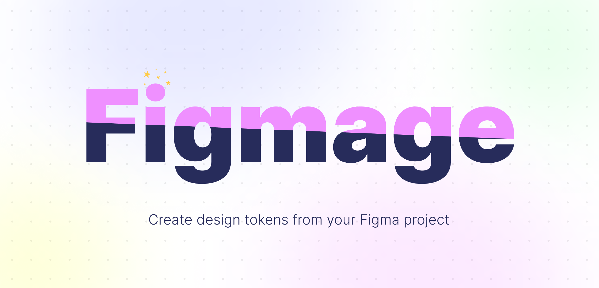

  

# 🧙‍♂️ Figmage

A CLI tool that helps you generate design tokens as code from your Figma project.

Turn your published Figma library into clean, typed design tokens — colors, typography, shadows, spacing, icons, and more — with a single config file and one command.

## 📚 Documentation

Full documentation lives on the **[Figmage docs website](https://temzasse.github.io/figmage)**.

### Introduction

- [Getting Started](https://temzasse.github.io/figmage/introduction/getting-started/)
- [Why Figmage](https://temzasse.github.io/figmage/introduction/why-figmage/)
- [Features](https://temzasse.github.io/figmage/introduction/features/)

### For developers

- [Developers Overview](https://temzasse.github.io/figmage/developers/)
- [Quickstart](https://temzasse.github.io/figmage/developers/quickstart/)
- [Install and Auth](https://temzasse.github.io/figmage/developers/install-and-auth/)
- [Configuration](https://temzasse.github.io/figmage/developers/configuration/)
- [Token Types](https://temzasse.github.io/figmage/developers/token-types/)
- [Spritesheets](https://temzasse.github.io/figmage/developers/spritesheets/)
- [CLI Reference](https://temzasse.github.io/figmage/developers/cli/)
- [Troubleshooting](https://temzasse.github.io/figmage/developers/troubleshooting/)
- [CI](https://temzasse.github.io/figmage/developers/ci/)
- [Recipes](https://temzasse.github.io/figmage/developers/recipes/)

### For designers

- [Designers Overview](https://temzasse.github.io/figmage/designers/)
- [Styles & Variables](https://temzasse.github.io/figmage/designers/styles-and-variables/)
- [Components](https://temzasse.github.io/figmage/designers/components/)
- [Naming & Grouping](https://temzasse.github.io/figmage/designers/naming-and-grouping/)
- [Publish & Share](https://temzasse.github.io/figmage/designers/publish-and-share/)
- [Handoff & Limitations](https://temzasse.github.io/figmage/designers/handoff-and-limitations/)

> [!NOTE]
> For legacy documentation see the [v1 README](https://github.com/Temzasse/figmage/blob/11fd931148b6698f8a1ccf81cc4f75a0dadc9e9e/README.md).

## License

[MIT](LICENSE.md)
