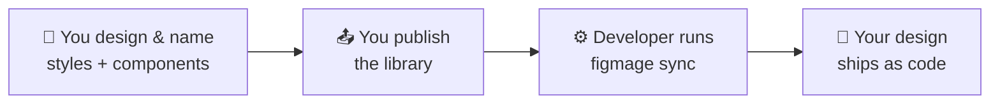

Welcome! This section is for designers and design system maintainers. Your job here isn't to write
code — it's to organize your Figma file so a tool called **Figmage** can read it and hand developers
the exact colors, type, spacing, and icons you designed. Do it well and the product will *look like
your designs*, automatically, every time you publish a change.

No engineering background required. If you can create a color style and a component in Figma, you can
prepare a design system Figmage will love.

## The big picture

You design in Figma as usual. When your work is ready, you **publish** it as a library. A developer
runs one command, and your styles and components become code in the product.

Three habits make this work beautifully, and they're the thread through every page in this section:

- **Make reusable values real.** Anything you reuse should be a Figma *style*, *variable*, or
  *component* — never a one-off.
- **Name things like an API.** Your names become the names developers type in code.
- **Publish when it's ready.** Nothing reaches developers until you publish.

New to the idea? Read [Why Figmage](/introduction/why-figmage/) for the bigger picture, or
[Getting Started](/introduction/getting-started/) for a quick orientation.

## Reading path

1. [Styles & Variables](/designers/styles-and-variables/) — colors, type, and shadows.
2. [Components](/designers/components/) — spacing/sizing scales, icons, and images.
3. [Naming & Grouping](/designers/naming-and-grouping/) — your contract with developers.
4. [Publish & Share](/designers/publish-and-share/) — make your work available to Figmage.
5. [Handoff & Limitations](/designers/handoff-and-limitations/) — a final checklist and what to know.
