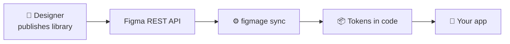

import { Card, CardGrid, LinkCard, LinkButton } from "@astrojs/starlight/components";

export const withBase = (path) => `${import.meta.env.BASE_URL.replace(/\/$/, "")}${path}`;

Figmage is a small CLI that reads your **published Figma library** through the Figma REST API and
generates design tokens as code — colors, typography, shadows, spacing, icons, and more. One config
file, one command, and your design decisions land in your codebase as typed, ready-to-import values.

<LinkButton href={withBase("/introduction/getting-started/")} icon="rocket">
  Get Started
</LinkButton>
<LinkButton href={withBase("/introduction/why-figmage/")} variant="minimal" icon="right-arrow">
  Why Figmage
</LinkButton>

## Pick your path

<CardGrid>
  <LinkCard
    title="🧑‍💻 For developers"
    href={withBase("/developers/quickstart/")}
    description="Install Figmage, set up auth, write a config, and run figmage sync to generate tokens. Start with the Quickstart."
  />
  <LinkCard
    title="🎨 For designers"
    href={withBase("/designers/")}
    description="No code required. Learn how to structure styles, components, and naming so Figmage can read your library cleanly."
  />
</CardGrid>

## What Figmage generates

<CardGrid>
  <LinkCard
    title="🎨 Colors"
    href={withBase("/developers/token-types/#style-based-tokens")}
    description="Color tokens from your Figma color styles, in hex, rgb, hsl, and more."
  />
  <LinkCard
    title="🔤 Typography"
    href={withBase("/developers/token-types/#style-based-tokens")}
    description="Full text tokens — family, size, weight, line height, and spacing — from text styles."
  />
  <LinkCard
    title="🌑 Shadows"
    href={withBase("/developers/token-types/#style-based-tokens")}
    description="Drop-shadow tokens extracted from your effect styles, ready for elevation systems."
  />
  <LinkCard
    title="📏 Spacing & sizing"
    href={withBase("/developers/token-types/#source-based-tokens")}
    description="Measured scales for spacing, sizing, and radii, derived straight from your components."
  />
  <LinkCard
    title="🖼️ Icons & images"
    href={withBase("/developers/token-types/#source-based-tokens")}
    description="Export components as individual SVGs, a single SVG sprite, or raster assets."
  />
  <LinkCard
    title="🛡️ Type-safe output"
    href={withBase("/developers/configuration/")}
    description="Generate ts, js, json, or svg — with autocompletion and build-time checks for TypeScript."
  />
</CardGrid>

## How it works

A designer publishes the library, Figmage reads it through the API, and `figmage sync` writes fresh
token files into your repo. Re-run it whenever the design system changes — your code stays in step
with Figma.

## Ready to dive in?

<CardGrid>
  <Card title="New to Figmage?" icon="open-book">
    Start with the [Introduction](/introduction/getting-started/) to understand what Figmage is and
    which track fits you, then jump into your audience's guide.
  </Card>
  <Card title="Want the benefits first?" icon="heart">
    Read [Why Figmage](/introduction/why-figmage/) for how it bridges design and development and
    keeps a design system honest.
  </Card>
</CardGrid>
