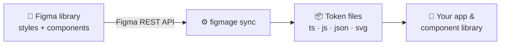

Figmage turns a **published Figma library** into **design tokens as code**. A designer prepares
styles and components in Figma; a developer runs one command and gets typed, ready-to-import token
files that stay in sync with the design source of truth.

The docs are split into two tracks. Pick the one that matches your role — most teams will use both.

## I build in code

If you configure and run Figmage, install it from your terminal and connect it to Figma:

1. [Install and Auth](/developers/install-and-auth/) — install the CLI and create a Figma access token.
2. [Quickstart](/developers/quickstart/) — run your first token sync.
3. [CLI](/developers/cli/) — the full command reference.

Then explore [the developer docs](/developers/) for config, transforms, and every token type.

## I design in Figma

If you prepare the design system in Figma, set up your styles and components so Figmage can read them
reliably:

1. [Publish & Share](/designers/publish-and-share/) — make your work visible to Figmage.
2. [Styles & Variables](/designers/styles-and-variables/) — colors, type, and effects.
3. [Naming & Grouping](/designers/naming-and-grouping/) — your contract with developers.

Then explore [the designer docs](/designers/) for components, icons, and the handoff checklist.

## Next

- New to design systems? Read [Why Figmage](/introduction/why-figmage/).
- Want the big picture of what it can do? See [Features](/introduction/features/).
